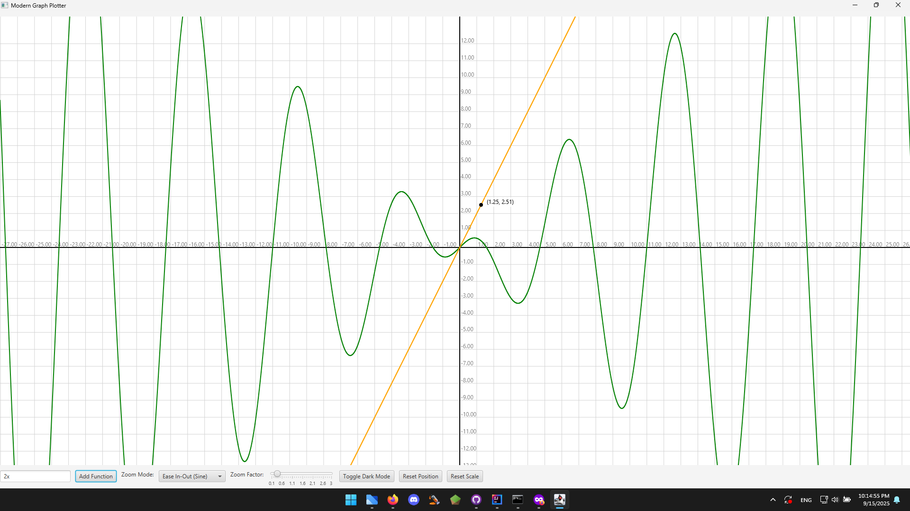

started as a fun project to test if function is odd or even in grade 11

can do things like
4x(pi) + 5 = 2
sin(x) = 0.5
it'll print more than 1 solution
you can also graph functions, ex:
xcosx, can also be written as xcos(x) or x*cos(x)

you can also type:
f(x) = 2x+5
choose option 2 to solve equation, choose any mode and you'll get the solution(s)
or you can also check if the function is odd or even