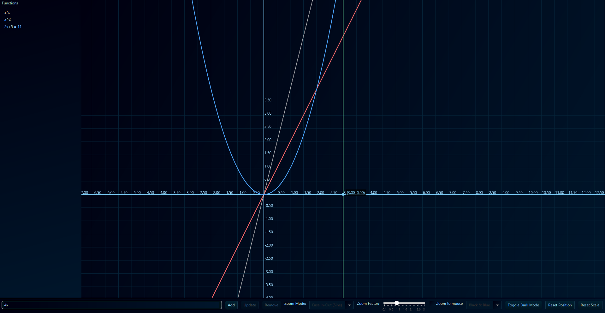

# Ascendancy Graphing Calculator

Ascendancy is a console-first calculator and graphing tool with a modern JavaFX graph window. It supports evaluating expressions, solving equations, analyzing functions, and plotting multiple functions/equations.

Originally started in 11th grade as a small project to check whether a function is odd or even, it has since grown into a more complete calculator and graphing utility.

Quick start examples:
 - `4x(pi) + 5 = 2`
 - `sin(x) = 0.5`
it'll print more than 1 solution
you can also graph functions, ex:
xcosx, can also be written as xcos(x) or x*cos(x)

you can also type:
f(x) = 2x+5
choose option 2 to solve equation, choose any mode and you'll get the solution(s)
or you can also check if the function is odd or even

## Installation

- **Build with Maven**:
  - Ensure Java 17+ and Maven are installed.
  - build/package it
  - The runnable JAR will be in `target/`.

- **Run**:
  - Double-click the JAR or use java -jar 

## Usage

At the `>` prompt you can enter expressions, functions, or commands.

- **Expressions**
  - Examples: `2+3*4`, `sqrt(2)`, `sin(1)`, `pi`, `e`.
- **Functions in x**
  - Example: `f(x) = x^2 + 2x + 1` or `x^2+2x+1`.
  - Then type `wasd` to open the function menu: check odd/even, solve, draw graph, or compute derivatives.
- **Equations**
  - Example: `2x+5 = 11`, `sin(x) = 0.5`, or `x = 3`.
  - Multiple real roots are printed when applicable.

## Commands

- **help | commands**: Show usage and examples.
- **wasd**: Open function tools menu for current `f(x)`.
- **system**: Solve a system of equations (you'll be prompted for count and equations).
- **ontop**: Toggle console always-on-top (Windows only).
- **setapikey**: Save Gemini API key for AI mode.
- **a47b**: Toggle AI Q&A mode.
- **exit**: Quit the program.

## Graphing

- Launch the graph from the function menu (`wasd` → option 3).
- Plot multiple functions and equation roots; intersections and hover readouts are shown.
- Performance/accuracy: rendering samples every pixel for accurate curves even when zoomed out.
 - Axes and origin: The X and Y axes are drawn, and the origin (0,0) is included. Hover near points (including the origin and intersections) to see precise coordinates.

## Tips

- Implicit multiplication is supported: `2x`, `xcos(x)`, `5(1+x)`.
- You can enter `f(x) = ...` or just the expression in x.
- If input fails, type `help` to see syntax and examples.

## License

This project started as a personal learning project; no formal license provided yet. Use at your own discretion.